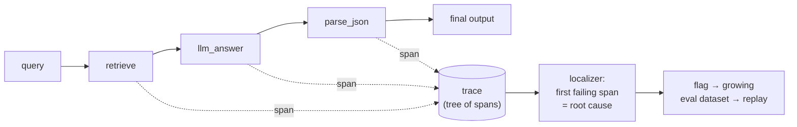
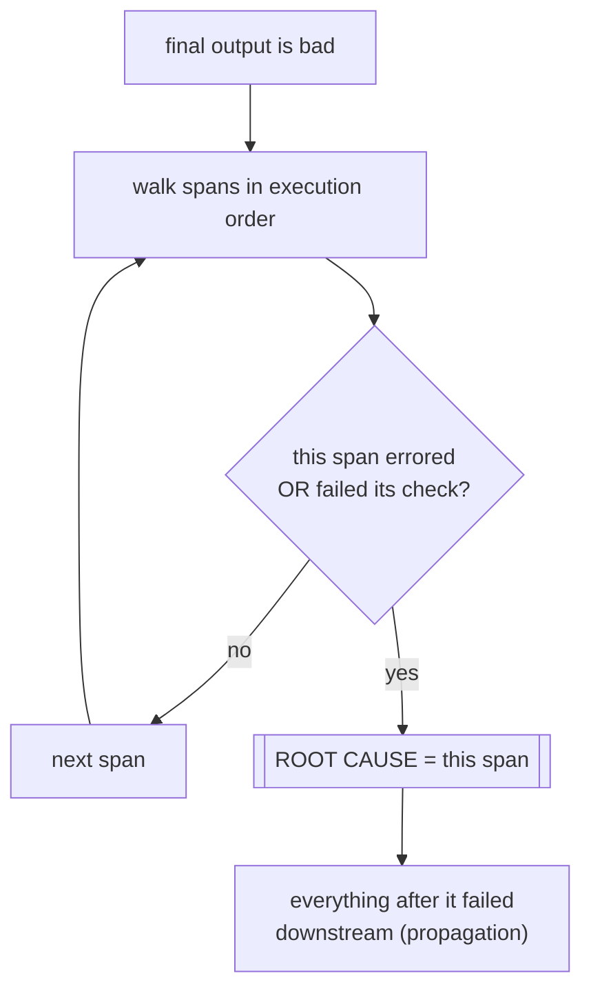

# Failure Forensics Tool for AI Pipelines

**Observability for multi-step AI pipelines that answers one question: *where
did it go wrong?*** It traces every step as OpenTelemetry-shaped spans, pinpoints
the **first** step that failed (the root cause, accounting for error
propagation), and feeds flagged failures into a **growing evaluation dataset**.
Essentially a mini LangSmith/Braintrust.

> When a chain of `retrieve → LLM → parse` produces garbage, the visible error is
> usually in the *last* step. But the last step failed because an earlier one fed
> it garbage. This tool blames the **root cause**, not the symptom.

[](https://github.com/NotEl1gible/ai-pipeline-forensics/actions/workflows/ci.yml)


---

## What it does



Every step is wrapped by a `@span` context manager. `contextvars` carry the
current parent, so a flat list of spans self-assembles into a **trace tree**.
When the output is bad, the **localizer** walks the tree and blames the first
failing step; flagged failures become **regression tests**.

## The core idea: error propagation



A naive tool blames the **last** error. This one blames the **first** failing
step, because everything after it is downstream of garbage.

---

## Measured demo (offline, mock — reproducible with no API key)

Break the LLM step: `parse_json` visibly **errors**, but the tool correctly
blames **`llm_answer`** as the root cause:

```text
$ python forensics.py demo --provider mock --break llm

=== trace a31f3f97   query: 'How do I get a refund for a damaged item?' ===
- pipeline        0.1ms  [OK   ]
  - retrieve        0.1ms  [OK   ]  check:PASS
  - llm_answer      0.0ms  [OK   ]  check:FAIL   <== ROOT CAUSE
  - parse_json      0.0ms  [ERROR]  check:FAIL

VERDICT: root cause = llm_answer   (answer/query keyword overlap = 0)
note: later steps failed downstream of this one (error propagation).
```

Break retrieval instead, and the blame moves up the chain to `retrieve` — even
though it returned docs without raising:

```text
$ python forensics.py demo --provider mock --break retrieve
  - retrieve        0.0ms  [OK   ]  check:FAIL   <== ROOT CAUSE
  - llm_answer      0.0ms  [OK   ]  check:FAIL
  - parse_json      0.0ms  [OK   ]  check:PASS
VERDICT: root cause = retrieve   (best retrieved-doc keyword overlap with query = 0)
```

**Feedback loop** — flagged failures grow an eval dataset and replay as a
regression suite:

```text
$ python forensics.py replay
[PASS] break=retrieve  expected=retrieve    got=retrieve
[PASS] break=llm       expected=llm_answer  got=llm_answer
[PASS] break=parse     expected=parse_json  got=parse_json
replay: 3/3 localized correctly
```

---

## Quickstart

```bash
pip install -r requirements.txt

# offline, no key — trace a run and localize the failure
python forensics.py demo  --provider mock
python forensics.py demo  --provider mock --break retrieve   # inject a failure
python forensics.py replay                                    # regression on the eval dataset
python forensics.py flag --break parse --expect parse_json    # add a case to the dataset

# real model for the llm step (put your key in a gitignored .env: ANTHROPIC_API_KEY=sk-ant-...)
python forensics.py demo --provider anthropic

# the gateway: feedback API + HTML trace viewer
uvicorn app:app --reload
# POST /flag  |  GET /replay  |  GET /traces  |  GET /trace/{id}  (tree with root cause highlighted)

pytest -q      # 7 offline tests
```

---

## How it works

**Span/Trace model** — an OpenTelemetry-shaped dataclass (`trace_id`, `span_id`,
`parent_span_id`, `name`, timing, `status`, `attributes`, `events`) **plus
explicit `input`/`output`** (OTel has no first-class I/O; we need it to localize).
A `Tracer.span()` context manager creates the span and uses `contextvars` to set
itself as the current parent, so children link up into a tree automatically.

**Per-step checks** — each step has a check for its failure mode: `retrieve`
(are the docs relevant to the query?), `llm_answer` (is the answer on-topic and
non-empty?), `parse_json` (is it valid JSON?).

**Localizer** — walks spans in execution order and returns the **first** that
errored or failed its check. First, not last, because propagation means later
failures are consequences.

**Storage** — every run is saved as an inspectable JSON trace file
(`traces/<id>.json`) plus a SQLite audit row per span.

**Feedback loop** — a flagged failure `{query, break, expected_culprit}` is
appended to `eval_dataset.jsonl`; `replay` re-runs every case and checks the
localizer still points at the right step. The dataset **grows from real
failures** (harvested, not hand-invented).

---

## Design decisions (and what's intentionally *not* here)

- **Mirror OpenTelemetry's span shape** with a tiny own model instead of pulling
  the heavy OTel SDK. Same fields, so it's export-compatible — real OTel export is
  a documented next step, not a dependency.
- **CLI tree + static HTML viewer first**, React/Streamlit later. The tree +
  root-cause highlight is the whole point; a heavy UI isn't.
- **One provider** (Claude `haiku` for the `llm_answer` step) + a deterministic
  `mock` for offline runs and tests. OpenAI plugs into the same seam later.
- **Single file** (`forensics.py`) + a thin `app.py`; grow into modules only when
  it hurts.

---

## Repo layout

```
forensics.py       # span/trace model, @span + contextvars, checks, localizer, pipeline, storage, feedback, CLI
app.py             # FastAPI: /flag (feedback), /replay, /trace/{id} HTML viewer
docs.jsonl         # tiny doc store for the demo RAG retrieve step
eval_dataset.jsonl # eval cases harvested from flagged failures (grows over time)
test_forensics.py  # 7 offline unit tests
requirements.txt
```

## Roadmap
- Real OpenTelemetry export (OTLP) so traces flow to Jaeger/Grafana/Datadog.
- Richer localizer: divergence attribution against expected intermediate outputs.
- React trace explorer; auto-flagging from online quality checks; Docker; OpenAI provider.

## License
MIT.
